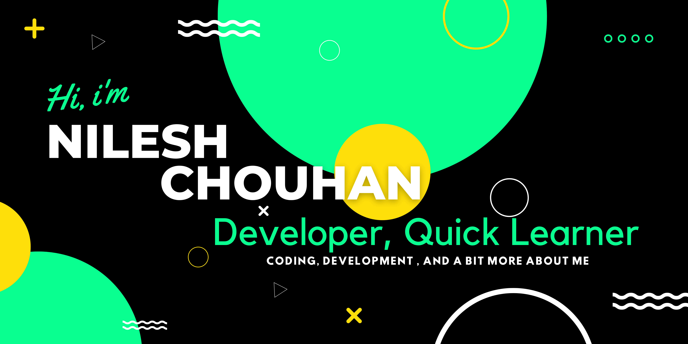

<h1 align="center">Hi 🙋, I'm Nilesh Chouhan</h1>
<h3 align="center">My name is Nilesh Chouhan and I'm B.Tech(Final Year) Student</h3>

- 🔭 I’m currently Pursuing <a href="#" target="_blank">Bachelor of Technology</a> in CSE.
- 💻 I’m currently working with C,C++,Java,Python.
- :heart: I love to research, design Logo,to code, build websites.
- :books: Learning new things,hard working and friendly.:smiley:
---
### Languages and Tools:

  
 
  
  
      
 
 
  
   

 

---

###  :computer: Contact me on:

---
---

### Sparetime: :parrot:
- :clapper: I like to visit anything cultural.
- :books: Reading a book,learning new things related to coing and development. 
- 🏏: Cricket Lover.
- :tulip: Enjoying family life and drink chai keeps me alive..
--- 

### My Github Stats

